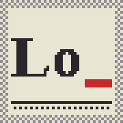

# Legend of _

Ein Survivor-Roguelite für den Browser im Stil eines alten Schwarzweißdrucks: schwarz, grau, Papier – und ein wenig Rot.
Der Strich im Titel ist dein Name. Kurz: **Lo_**.

**Spielen:** https://loo-pixel.github.io/legend/

## Worum es geht

Du bist eine winzige Figur in einer großen, zufällig erzeugten Landschaft. Feinde kommen von selbst, deine Waffen feuern von selbst – du läufst, sammelst und entscheidest.

- Sechs Ebenen in zwei Landschaften: Ebene 1–3 im Grünland, Ebene 4–6 in der Wüste. Nach Ebene 6 heißt es „Fin“.
- Jede Ebene dauert **5 Minuten**. Dann kommt der Boss: Knochenkönig, Waldgeist und Kakodämon im Grünland; Grabwächter, Sandgoblin und Wüstenauge in der Wüste.
- In jeder Landschaft wird es von Ebene zu Ebene dunkler; Laternen an den Straßen und dein eigener Lichtschein helfen.
- Im Endlosmodus (frei nach Ebene 3) kommt jede Ebene zufällig aus einer der beiden Landschaften, und alle sieben Bosse können auftreten – auch der Pilzfürst, den es nur dort gibt.
- Ist er besiegt, öffnet sich ein Tor. Du hast **25 Sekunden**, sonst holt dich die Dunkelheit.
- Hinter dem Tor liegt die nächste Ebene: neue Karte, neue und stärkere Gegner.
- Bei jedem Stufenaufstieg wählst du eine von drei Karten. Platz ist für höchstens 10 Waffen und Fähigkeiten.
- In den Einstellungen lassen sich Musik, Wölbung, Schatten, Wolken, Bloom, Sandwehen und die gekaufte zweite Startwaffe ein- und ausschalten. Nach Ebene 6 kommt der Farbmodus dazu.
- Gold bleibt nach dem Tod erhalten. Beim Krämer kaufst du damit dauerhafte Verbesserungen und füllst die Waffenkammer: Zu Beginn gibt es nur ein Startpaket, jede weitere Waffe, Fähigkeit, Boss-Kraft und jeder Bauplan für den Schmied wird erst gekauft.

## Was es in der Welt gibt

- Stadt, Dörfer, Straßen, Brücken, Seen, Flüsse (durchwatbar, aber langsam), Wälder, Berge
- Kirche und Kapellen heilen ein wenig – solange ihre Fenster offen sind
- Friedhöfe, Mühlen, Ruinen, Türme und Steinkreise bergen Proviant oder Fundstücke
- Ein Opferaltar mit Magnet, bewacht von der Fleischkugel
- Ein Stall: für 25 Gold gibt es ein Pferd, einmal pro Ebene
- Eine Tierhandlung im Hauptmenü: Katze, Hund, Lama oder Schleim begleitet dich, immer nur eines je Lauf. Tiere lernen mit und behalten ihre Stufe
- Ein Schmied: für 60 Gold verschmilzt er zwei Waffen ab Stufe III zu einem Schmiedewerk – 16 Werke gibt es, eines je Ebene
- Manche Welten haben ein riesiges Monument: Weltenbaum, Burg, Säule, Statue, Gruft – in der Wüste auch eine Pyramide
- Die Wüste: Sand und Dünen, Oasen mit Palmen, trockene Flussbetten, rote Felsplateaus, Lehmhäuser, Kakteen

Alles Weitere steht im **Almanach** im Hauptmenü.

## Steuerung

| Gerät | Bewegen | Sonst |
| --- | --- | --- |
| iPhone / iPad | Finger aufs Bild legen und ziehen | Knöpfe für Karte und Pause |
| PC | WASD oder Pfeiltasten | Maus für Karte, Pause und Menüs |

Angegriffen wird automatisch.

## Seeds

Jede Welt entsteht aus einer Zahl. Gleicher Seed, gleiche Welt. Im Menü kannst du würfeln, einen Seed eintippen oder einen Link kopieren und weitergeben.

## Auf den Homescreen

In Safari: Teilen → „Zum Home-Bildschirm“. Dann läuft das Spiel im Vollbild.

## Speichern

Der Spielstand liegt nur in deinem Browser (IndexedDB). Es gibt kein Konto und keinen Server. Wer die Browserdaten löscht, löscht auch den Stand. In den Einstellungen lässt sich der Fortschritt auch gezielt zurücksetzen – Einstellungen und Name bleiben dabei. Im privaten Modus kann Safari das Speichern verweigern; das Menü weist dann darauf hin.

## Technik

- Eine einzige `index.html`, reines JavaScript und Canvas, kein Build-Schritt, keine Bibliotheken
- Daneben liegen nur `musik.mp3` (Grünland), `music2.mp3` (Wüste) und `icon.png`
- Das Bild wird in Software gezeichnet und per Raster auf drei Töne plus Rot gebracht

Zum Selberhosten genügt es, die vier Dateien in ein Verzeichnis zu legen.

## Credits

- Idee und Spiel: Olfbert
- Code: mit Claude (Anthropic) entstanden
- Musik Grünland: „Shadow Riff“, erzeugt mit Suno AI
- Musik Wüste: „Descent of the Sands“, erzeugt mit Suno AI
- Boss-Figur (Knochenkönig): [Sword Skeleton – Pixel Art Character](https://sanctumpixel.itch.io/sword-skeleton-pixel-art-character) von Sanctumpixel
- Boss-Figur (Waldgeist): [The Forest Spirit](https://pidroudays.itch.io/the-forest-spirit) von pidroudays
- Boss-Figur (Kakodämon): [2D Pixel Art Cacodaemon Sprites](https://elthen.itch.io/2d-pixel-art-cacodaemon-sprites) von Elthen
- Boss-Figur (Grabwächter): Skeleton aus [Monsters Creatures Fantasy](https://luizmelo.itch.io/monsters-creatures-fantasy) von Luiz Melo
- Boss-Figur (Sandgoblin): Goblin aus [Monsters Creatures Fantasy](https://luizmelo.itch.io/monsters-creatures-fantasy) von Luiz Melo
- Boss-Figur (Wüstenauge): Flying Eye aus [Monsters Creatures Fantasy](https://luizmelo.itch.io/monsters-creatures-fantasy) von Luiz Melo
- Boss-Figur (Pilzfürst, nur im Endlosmodus): Mushroom aus [Monsters Creatures Fantasy](https://luizmelo.itch.io/monsters-creatures-fantasy) von Luiz Melo

Projektseite: https://loo-pixel.github.io/legend/
